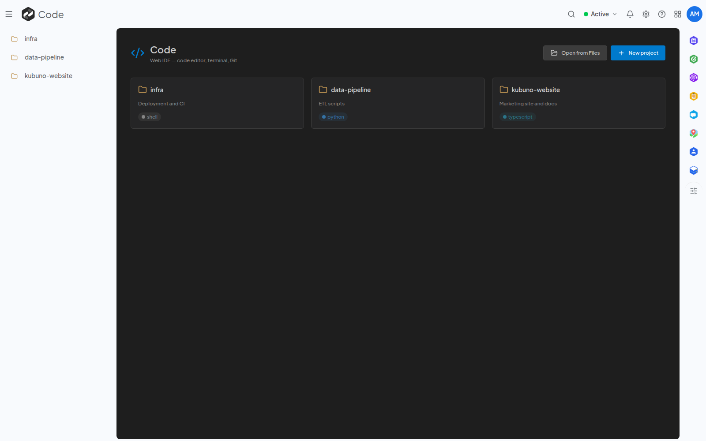

<!--
  SPDX-FileCopyrightText: 2026 Kubuno contributors
  SPDX-License-Identifier: AGPL-3.0-or-later
-->

<div align="center">


# Kubuno — Code

[](LICENSE)


**A web-based code editor for Kubuno — a full workbench in the browser for reading, writing and organising code, with Git and extensions, backed by your own storage.**

A module for [Kubuno](https://github.com/kubuno/core), the self-hosted, libre (AGPLv3) cloud platform — a sovereign alternative to the mainstream productivity suites.

</div>

---

## Screenshots



<sub>Projects in the web IDE</sub>

## Features

- **Rich code editor** — a Monaco-powered editing surface with syntax highlighting, multi-tab editing, a command palette and a status bar.
- **Projects & explorer** — organise your work into projects with a file-tree explorer; create, rename, move and delete files and folders, with a per-user project cap an administrator can set.
- **Project-wide search** — find across the files of a project from a dedicated search panel.
- **Git integration** — clone a remote repository into a new project, stage changes, commit, and browse branches, diffs and history — all without leaving the editor.
- **Extensions** — browse and install editor extensions from a configurable registry (**Open VSX** by default), so the workbench can be tailored per instance.
- **Instance controls** — a maximum file size for opening and saving, the extension-registry endpoint, the per-user project ceiling, and a strict remote-clone policy (allowed-hosts list) editable from the core admin console.
- **Your choice of database** — runs on PostgreSQL, MySQL/MariaDB or SQLite: a single build connects to whichever engine the instance is configured with, and SQLite makes a self-contained, server-less install possible.
- **Per-user preferences** — editor settings saved with the signed-in account and applied everywhere.

> **No code execution on the host.** Kubuno Code is an editor and IDE, not a runtime: it reads, writes and organises source files but never runs them on the server. Consistent with the platform's seccomp sandbox, the module spawns no processes; the **only** outgoing connection it opens on a user's behalf is `git clone`, restricted to `https://` and further narrowable to an allow-list of hosts (loopback, private and link-local addresses — including cloud metadata endpoints — are always refused).

## Architecture

Code is a **separate process** (a standalone Rust binary listening on port **3112**) that registers with the [core](https://github.com/kubuno/core) at startup. The core proxies its routes (`/api/v1/code/*`), distributes platform events to it and manages its lifecycle; it also serves the module's runtime-loaded React frontend bundle through the host import map.

- **Backend** — `src/`: Axum + SQLx through the shared `kubuno-db` layer (PostgreSQL, MySQL/MariaDB or SQLite, chosen at run time; namespace `code`); migrations in `migrations/`. Files, projects, Git and the extension registry are handled server-side; nothing is ever executed.
- **Frontend** — `frontend/`: a React bundle built to `entry.js`, consuming `@kubuno/sdk`, `@kubuno/ui` (`@ui`) and `@kubuno/drive` from npm — resolved by the host at runtime via the import map, never re-bundled.

## Install

A Kubuno module is distributed as a single **`.kbpkg`** — a portable package that the Kubuno server installs by itself, the same file on Linux, Windows and macOS. It is not a system service and ships in no other format.

The easiest way to self-host a full Kubuno instance (core + every module) is the all-in-one **Docker image** (`ghcr.io/kubuno/kubuno`); see **[kubuno/docker](https://github.com/kubuno/docker)**. To install Code into an existing instance, grab the `.kbpkg` from the [GitHub Releases](https://github.com/kubuno/code/releases) and let the core unpack it — from the admin console's module marketplace, or offline from the CLI:

```bash
sudo kubuno modules:install code-<version>-<os>-<arch>.kbpkg
sudo systemctl restart kubuno            # the core loads the module on (re)start
```

## Build & development

**Requirements:** Rust ≥ 1.82, Node.js ≥ 24, and a database — PostgreSQL 16, MySQL/MariaDB or SQLite.

```bash
cargo build --release                      # → target/release/kubuno-code
cd frontend && npm ci && npm run build     # → dist/{entry.js, entry.css}
bash build_kbpkg.sh                         # → dist/code-<version>-<os>-<arch>.kbpkg
bash build_kbpkg.sh --install              # build, install into the module store and restart
```

> Shared dependencies come from Kubuno — no `kubuno/core` checkout required:
> - **Rust** — shared crates via tagged git dependencies on `kubuno/core`.
> - **Frontend** — `@kubuno/sdk`, `@kubuno/ui`, `@kubuno/drive` from the `@kubuno` npm scope.

## Tech stack

Rust 2021 · Axum 0.7 · Tokio · SQLx 0.9 via `kubuno-db` (PostgreSQL 16 · MySQL/MariaDB · SQLite) — React 19 · TypeScript · Vite · Tailwind CSS v4 · Zustand · React Query · Monaco editor.

## Contributing

Contributions are welcome. Please open an issue to discuss any significant change before submitting a pull request.

## License

[AGPL-3.0-or-later](LICENSE) © Kubuno contributors.
